### What was built / upgraded

**1. Main package `README.md`**
- Shields.io badges (Solana, MIT, Phase 0 Complete, Author, Org)
- Tags / topics line
- Phase progress bars (table + overall readiness)
- Mermaid **flowchart** (Users → GitHub Apps → On-chain → Privacy)
- Mermaid **mindmap** of compliance pillars
- Mermaid **Gantt** roadmap timeline
- Flagship repo status table with progress bars
- Author credit: **Rickcreator1987**
- Package layout, how-to-apply, next priorities

**2. Organization profile** (`.github/profile/README.md`)
- Matching badges + author badge
- Progress snapshot bars
- Tags
- Mermaid architecture flow (Off-chain → Bridge → On-chain)
- Mermaid **pie** chart of compliance stack weight
- Full team structure + flagship repos
- Mission, getting started, contact
- Author: **Rickcreator1987**

**3. Supporting docs refreshed**
- `roadmap/ROADMAP.md` — author + date 2026-09-18
- `roadmap/STATUS-CHECKLIST.md` — author + date; org-profile + tags marked done
- `architecture/HIVE_OVERVIEW.md` — author + date

All files live under `artifacts/GitDigital-Solana/`.  

Phase 0 foundation is now presentation-ready for the org, with clear visual progress, diagrams, and attribution to **Rickcreator1987**.


---

**Mermaid Gantt syntax** lets you draw project timelines directly in Markdown. GitHub, GitLab, Notion, and many docs tools render it automatically.

### Basic structure

```mermaid
gantt
    title Project Timeline
    dateFormat  YYYY-MM-DD
    section Phase Name
    Task name           :status, id, start, end
```

### Key elements

| Part | Meaning | Example |
|------|---------|---------|
| `gantt` | Starts a Gantt diagram | required first line |
| `title` | Chart title | `title GitDigital Solana Roadmap` |
| `dateFormat` | How dates are written | `YYYY-MM`, `YYYY-MM-DD`, `YYYY-MM-DD HH:mm` |
| `section` | Groups tasks (a horizontal band) | `section Phase 0` |
| Task line | The actual bar | `Foundation & Hygiene :done, p0, 2026-09, 2026-09` |

### Task line format

```
Task name : [status,] id, start, end
```

or

```
Task name : [status,] id, start, duration
```

**Common status keywords** (optional, controls color):

- `done`     → completed (usually green/gray)
- `active`   → currently in progress (highlighted)
- `crit`     → critical path
- `milestone`→ diamond marker instead of a bar

**Examples:**

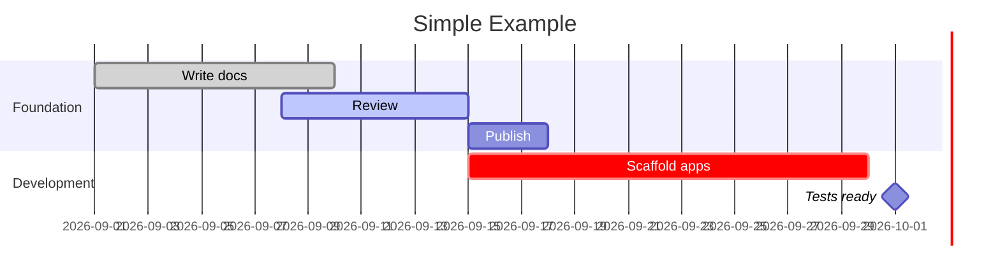

### Useful options

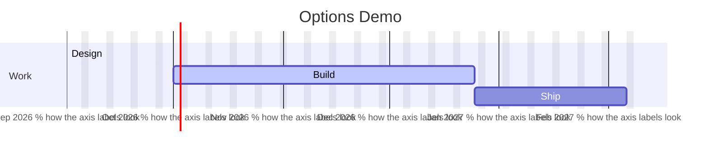

### Relating tasks to each other

- `after taskId` → starts when another task ends  
- `until taskId` → ends when another task starts  
- Duration units: `d` (days), `w` (weeks), `M` (months), `y` (years)

### The exact chart used in the GitDigital README

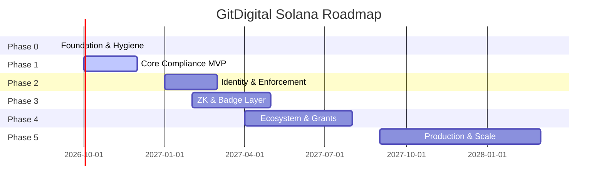

- `dateFormat YYYY-MM` → month-level precision  
- `:done` marks Phase 0 complete  
- `:active` highlights Phase 1 as current  
- Other phases have no status → default (future) styling  

That’s the full practical syntax for the Gantt charts used in the GitDigital Solana docs.


**Mermaid Sequence Diagrams** show how participants interact over time — perfect for explaining GitHub App flows, Transfer Hook checks, identity lookups, and compliance pipelines.

### Basic skeleton

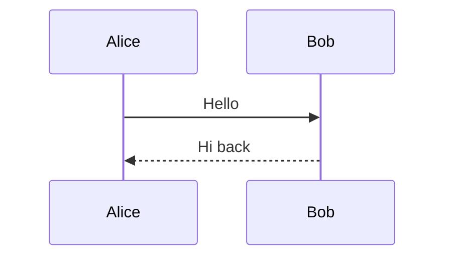

### Core building blocks

| Syntax | Meaning |
|--------|---------|
| `participant X` / `actor X` | Declares a participant (box) or actor (stick figure) |
| `A->>B: message` | Solid arrow (synchronous / request) |
| `A-->>B: message` | Dashed arrow (response / async) |
| `A-)B: message` | Open arrow (async fire-and-forget) |
| `A--xB: message` | Crossed (failed / rejected) |
| `activate A` / `deactivate A` | Shows an activation box (lifeline highlight) |
| `Note over A,B: text` | Note spanning one or more participants |
| `Note right of A: text` | Note on one side |
| `loop Description` … `end` | Repeating block |
| `alt Condition` … `else` … `end` | Alternative paths |
| `opt Optional` … `end` | Optional path |
| `par Parallel` … `and` … `end` | Concurrent actions |
| `critical` … `end` | Critical section |
| `break` … `end` | Early exit |

---

### 1. Simple request / response

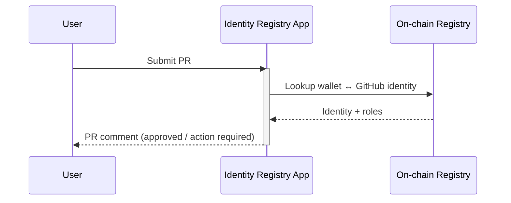

---

### 2. Compliance Guard full flow (GitDigital style)

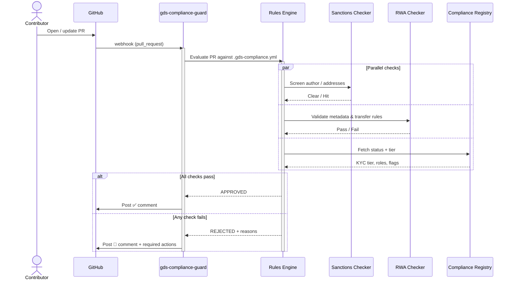

---

### 3. Token-2022 Transfer Hook sequence

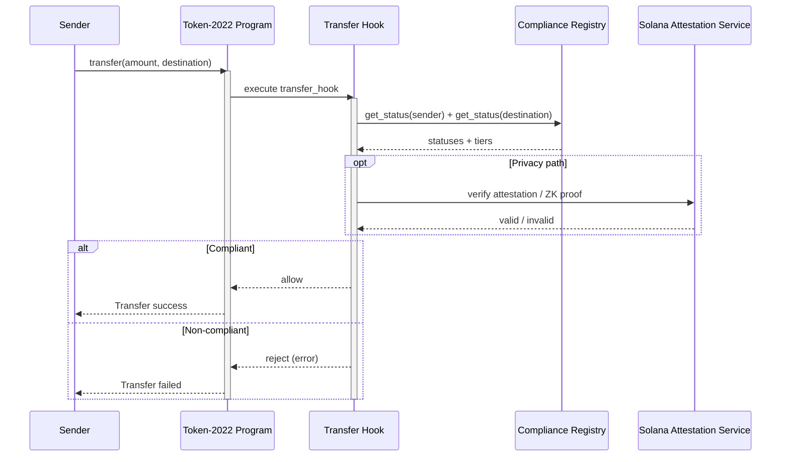

---

### 4. Useful advanced patterns

**Activation boxes (show “busy” time):**
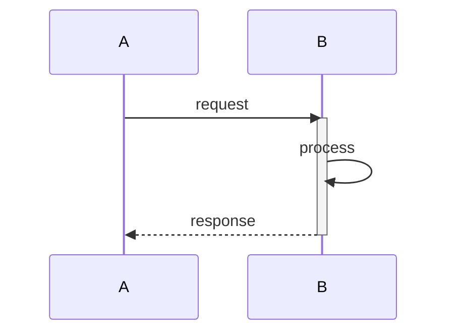

**Loop + break:**
```mermaid
sequenceDiagram
    participant Client
    participant API
    loop Retry up to 3 times
        Client->>API: call
        alt Success
            API-->>Client: 200
            break
        else Error
            API-->>Client: 5xx
        end
    end
```

**Notes for documentation:**
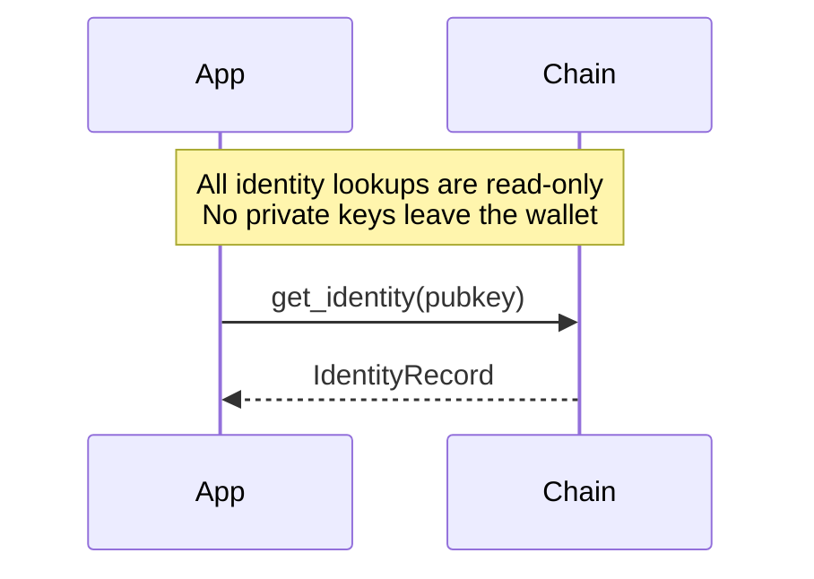

---

### Best practices for GitDigital docs

1. Use clear participant aliases (`participant Guard as gds-compliance-guard`).
2. Prefer `activate` / `deactivate` on the main service so the “work” is visible.
3. Group parallel independent checks with `par … and … end`.
4. Always show the failure path with `alt` / `else` — compliance diagrams need the reject case.
5. Keep notes short; put deep policy details in the surrounding Markdown.

Would you like a polished sequence diagram added to the main README or to one of the GitHub App READMEs (identity-registry or compliance-guard)?


---


**Mermaid State Diagrams** show how a system moves between discrete states and what triggers those transitions. They are ideal for modelling compliance status, identity verification, PR lifecycle, Transfer Hook decisions, and badge issuance.

### Basic skeleton

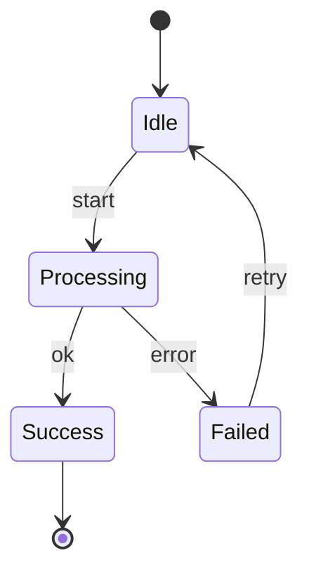

- `stateDiagram-v2` is the modern syntax (preferred).
- `[*]` is the start / end pseudostate.
- `State --> State : trigger` defines a transition.

---

### Core syntax

| Construct | Syntax | Purpose |
|-----------|--------|---------|
| Simple state | `state Name` | A named state |
| Transition | `A --> B : event` | Move from A to B on event |
| Start / End | `[*] --> A` / `A --> [*]` | Entry and exit points |
| Composite (nested) | `state Parent { ... }` | States inside states |
| Choice (decision) | `state choice <<choice>>` | Diamond decision point |
| Fork / Join | `state fork <<fork>>` / `<<join>>` | Parallel paths |
| Note | `note right of State : text` | Annotation |
| Description | `State : description text` | Multi-line details inside a state |

---

### 1. Simple compliance status lifecycle

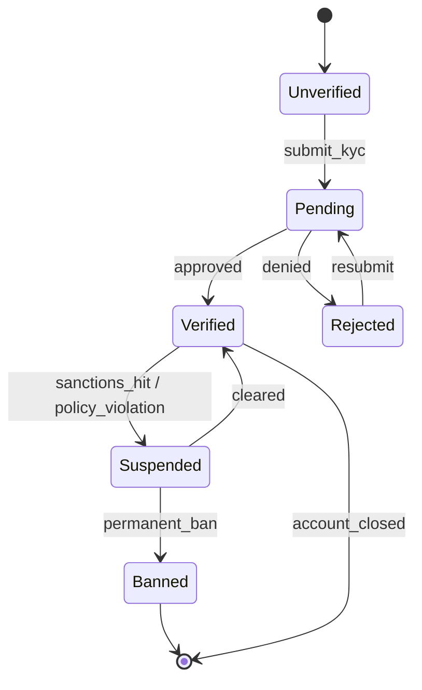

---

### 2. GitHub App PR review states (identity + compliance)

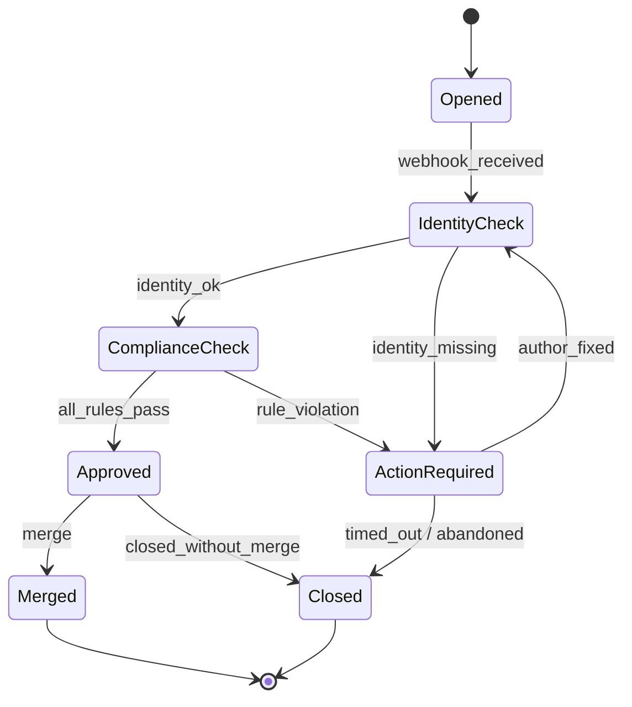

---

### 3. Nested / composite states (Transfer Hook decision)

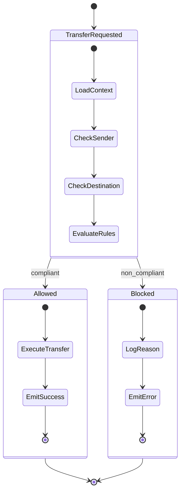

---

### 4. Choice / decision node

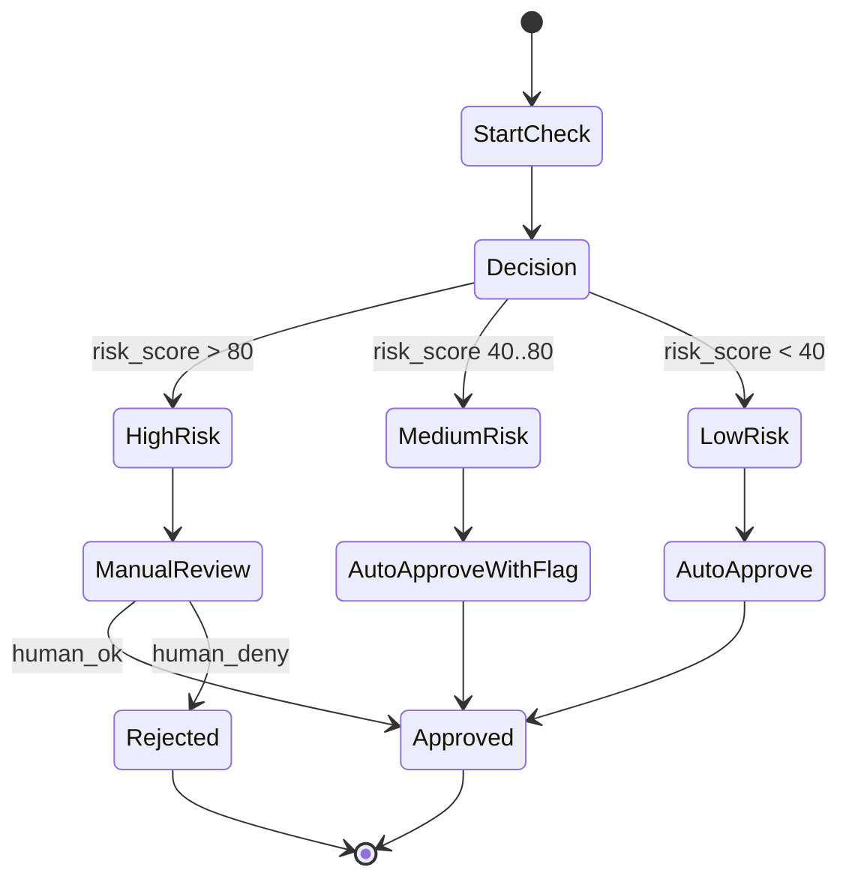

---

### 5. Parallel regions (fork / join)

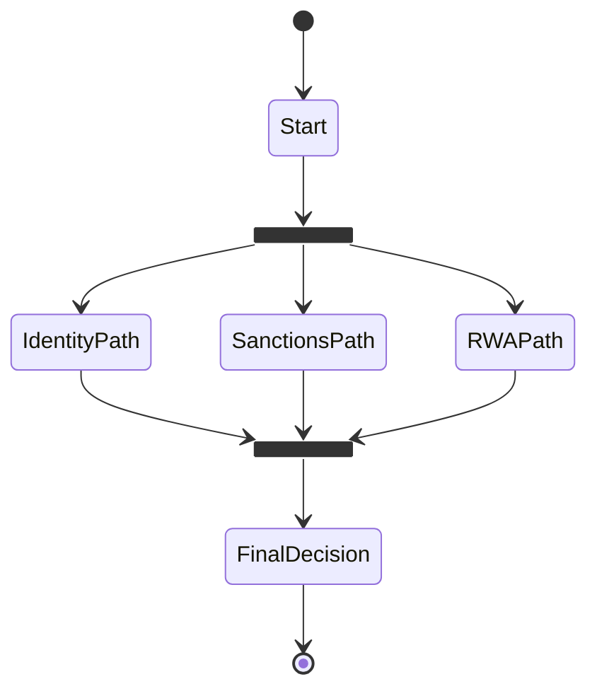

---

### Useful patterns for GitDigital docs

**Identity verification states**
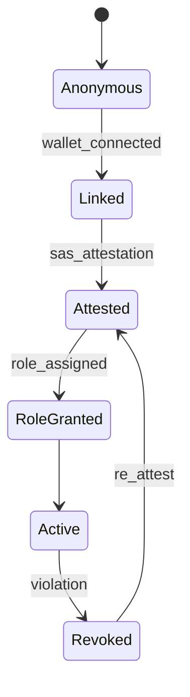

**Token / RWA lifecycle**
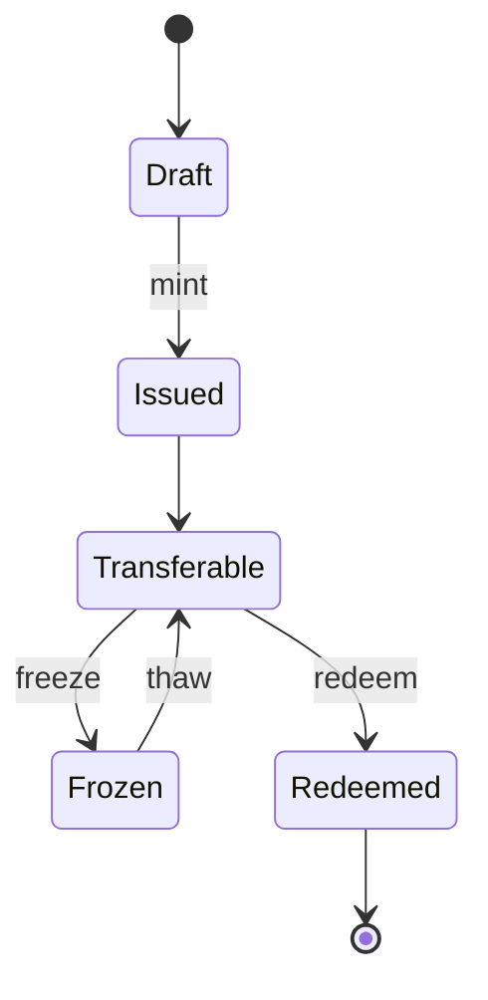

---

### Tips

1. Prefer `stateDiagram-v2` over the older `stateDiagram`.
2. Keep state names short and noun-like (`Verified`, `ActionRequired`, `Blocked`).
3. Put the triggering event after the colon (`--> : approved`).
4. Use nested states when a phase itself has sub-steps (e.g. Transfer Hook internal pipeline).
5. Choice nodes (`<<choice>>`) are excellent for risk-score or tier-based branching.
6. Notes are great for linking to policy docs:  
   `note right of Suspended : See SECURITY.md §3.2`

Would you like a ready-to-paste state diagram added to the main README, the compliance-guard README, or the identity-registry README?


---


**Mermaid Sequence Diagrams** visualize interactions between participants over time. They are excellent for documenting GitHub App webhooks, Transfer Hook calls, identity lookups, compliance checks, and multi-party flows.

### Basic structure


- `sequenceDiagram` starts the diagram.
- `participant` (or `actor`) declares the boxes/people.
- Arrows show the messages.

---

### Message / arrow types

| Syntax | Meaning | Typical use |
|--------|---------|-------------|
| `A->>B: msg` | Solid line with filled arrow | Synchronous request |
| `A-->>B: msg` | Dashed line with filled arrow | Response / reply |
| `A-)B: msg` | Solid line with open arrow | Async / fire-and-forget |
| `A--)B: msg` | Dashed line with open arrow | Async response |
| `A-xB: msg` | Solid line with cross | Failed / rejected call |
| `A--xB: msg` | Dashed line with cross | Failed response |

---

### Activation (lifeline highlighting)

Shows when a participant is “busy”:

```mermaid
sequenceDiagram
    participant Client
    participant API
    Client->>API: call
    activate API
    API->>API: process
    API-->>Client: result
    deactivate API
```

You can also use `+` / `-` shorthand:

```mermaid
sequenceDiagram
    Client->>+API: call
    API-->>-Client: result
```

---

### Notes

```mermaid
sequenceDiagram
    participant App
    participant Chain
    Note over App,Chain: Read-only lookup<br/>No private keys leave the client
    Note right of App: Runs in GitHub App context
    App->>Chain: getStatus(pubkey)
    Chain-->>App: StatusRecord
```

---

### Control flow blocks

**Alternative paths (`alt` / `else`)**
```mermaid
sequenceDiagram
    participant Guard
    participant Engine
    Guard->>Engine: evaluate(PR)
    alt All rules pass
        Engine-->>Guard: APPROVED
    else Rule violation
        Engine-->>Guard: REJECTED + reasons
    end
```

**Optional (`opt`)**
```mermaid
sequenceDiagram
    participant Hook
    participant SAS
    opt Privacy path enabled
        Hook->>SAS: verify ZK / attestation
        SAS-->>Hook: valid / invalid
    end
```

**Loop**
```mermaid
sequenceDiagram
    participant Client
    participant API
    loop Retry ≤ 3 times
        Client->>API: request
        alt Success
            API-->>Client: 200
        else Error
            API-->>Client: 5xx
        end
    end
```

**Parallel (`par` / `and`)**
```mermaid
sequenceDiagram
    participant Engine
    participant Sanctions
    participant RWA
    participant Registry
    par Independent checks
        Engine->>Sanctions: screen
        Sanctions-->>Engine: result
    and
        Engine->>RWA: validate metadata
        RWA-->>Engine: result
    and
        Engine->>Registry: fetch tier
        Registry-->>Engine: result
    end
```

**Critical section & break**
```mermaid
sequenceDiagram
    participant App
    participant DB
    critical Acquire lock
        App->>DB: lock(resource)
        App->>DB: update
        App->>DB: unlock
    end
    break On fatal error
        App-->>App: abort
    end
```

---

### Practical GitDigital examples

**1. Identity Registry App – PR validation**

```mermaid
sequenceDiagram
    actor Contributor
    participant GH as GitHub
    participant App as solana-identity-registry-app
    participant Registry as Identity Registry

    Contributor->>GH: Open / synchronize PR
    GH->>App: pull_request webhook
    activate App
    App->>Registry: lookup(github_user)
    Registry-->>App: wallet + roles + status
    alt Identity found & roles sufficient
        App->>GH: Post ✅ comment
    else Missing or insufficient
        App->>GH: Post ⚠️ Action Required comment
    end
    deactivate App
```

**2. Compliance Guard – full parallel check**

```mermaid
sequenceDiagram
    participant GH as GitHub
    participant Guard as gds-compliance-guard
    participant Engine as Rules Engine
    participant Sanctions
    participant RWA
    participant Registry as Compliance Registry

    GH->>Guard: pull_request webhook
    activate Guard
    Guard->>Engine: load .gds-compliance.yml + evaluate
    activate Engine

    par Parallel checks
        Engine->>Sanctions: screen author & addresses
        Sanctions-->>Engine: clear / hit
    and
        Engine->>RWA: check metadata & transfer rules
        RWA-->>Engine: pass / fail
    and
        Engine->>Registry: get status + tier
        Registry-->>Engine: record
    end

    alt All pass
        Engine-->>Guard: APPROVED
        Guard->>GH: ✅ comment
    else Any fail
        Engine-->>Guard: REJECTED + reasons
        Guard->>GH: 🚫 comment + required actions
    end
    deactivate Engine
    deactivate Guard
```

**3. Token-2022 Transfer Hook**

```mermaid
sequenceDiagram
    participant Sender
    participant Token as Token-2022
    participant Hook as Transfer Hook
    participant Registry as Compliance Registry
    participant SAS as Attestation Service

    Sender->>Token: transfer(…)
    activate Token
    Token->>Hook: execute transfer_hook
    activate Hook
    Hook->>Registry: get_status(sender) + get_status(dest)
    Registry-->>Hook: statuses
    opt ZK / privacy path
        Hook->>SAS: verify attestation
        SAS-->>Hook: valid / invalid
    end
    alt Compliant
        Hook-->>Token: allow
        Token-->>Sender: success
    else Non-compliant
        Hook-->>Token: reject
        Token-->>Sender: error
    end
    deactivate Hook
    deactivate Token
```

---

### Tips for clean diagrams

1. Give participants short, clear aliases (`participant Guard as gds-compliance-guard`).
2. Use `activate` / `deactivate` (or `+/-`) on the main service so the “work window” is visible.
3. Prefer `par` for independent checks (sanctions + RWA + registry).
4. Always show the failure path with `alt`/`else` — compliance flows need the reject case.
5. Keep notes short; put detailed policy in the surrounding Markdown.
6. Group related participants left-to-right in the order they appear in the flow.

Would you like me to drop any of these (or a new one) into the main README, the compliance-guard README, or the identity-registry README?


---


**Mermaid Styling Options** let you control colors, shapes, line styles, and themes so diagrams match your project branding (e.g. Solana purple, compliance green/red, GitDigital dark theme).

### 1. Inline styling with `style` and `classDef`

Works best in **flowchart**, **graph**, and **state** diagrams.

```mermaid
flowchart TB
    A[Start] --> B[Check]
    B --> C[Approved]
    B --> D[Rejected]

    style A fill:#9945FF,stroke:#fff,color:#fff
    style C fill:#14F195,stroke:#0a0,color:#000
    style D fill:#FF6B6B,stroke:#900,color:#fff
```

**Reusable classes** (preferred):

```mermaid
flowchart LR
    A --> B --> C

    classDef solana fill:#9945FF,stroke:#7B2CBF,color:#fff,stroke-width:2px
    classDef success fill:#14F195,stroke:#0d9,color:#000
    classDef danger fill:#FF6B6B,stroke:#c00,color:#fff
    classDef neutral fill:#1E1E1E,stroke:#555,color:#eee

    class A solana
    class B neutral
    class C success
```

You can also apply a class at declaration time:

```mermaid
flowchart TB
    A:::solana --> B:::success
    classDef solana fill:#9945FF,color:#fff
    classDef success fill:#14F195,color:#000
```

---

### 2. Link / edge styling

```mermaid
flowchart LR
    A -->|pass| B
    A -->|fail| C

    linkStyle 0 stroke:#14F195,stroke-width:3px
    linkStyle 1 stroke:#FF6B6B,stroke-width:3px,stroke-dasharray: 5 5
```

- `linkStyle index` targets the N-th link (0-based, in order of appearance).
- Useful properties: `stroke`, `stroke-width`, `stroke-dasharray`.

---

### 3. Sequence diagram styling

Sequence diagrams use a different set of directives:

```mermaid
sequenceDiagram
    participant Contributor
    participant Guard as gds-compliance-guard
    participant Registry

    Contributor->>Guard: PR opened
    Guard->>Registry: lookup
    Registry-->>Guard: status
    Guard-->>Contributor: comment

    %% Styling
    Note over Guard: Main enforcement point
```

You can color participants and notes with CSS-like classes in some renderers, but the most reliable way is the global theme (see below) or:

```mermaid
sequenceDiagram
    participant A
    participant B
    A->>B: message
```

Advanced styling for sequence is more limited than flowcharts; most people rely on the theme.

---

### 4. State diagram styling

```mermaid
stateDiagram-v2
    [*] --> Unverified
    Unverified --> Verified : approved
    Verified --> Suspended : violation
    Suspended --> Verified : cleared
    Suspended --> Banned : permanent
    Banned --> [*]

    classDef ok fill:#14F195,color:#000
    classDef warn fill:#FFD166,color:#000
    classDef bad fill:#FF6B6B,color:#fff
    classDef startend fill:#9945FF,color:#fff

    class Verified ok
    class Suspended warn
    class Banned bad
    class Unverified startend
```

---

### 5. Global theme & `init` directive (most powerful)

Place this **before** the diagram (or in a `%%{init: ...}%%` block):

```mermaid
%%{init: {
  "theme": "dark",
  "themeVariables": {
    "primaryColor": "#9945FF",
    "primaryTextColor": "#ffffff",
    "primaryBorderColor": "#7B2CBF",
    "lineColor": "#14F195",
    "secondaryColor": "#1E1E1E",
    "tertiaryColor": "#0D1117",
    "background": "#0D1117",
    "mainBkg": "#161B22",
    "nodeBorder": "#30363D",
    "clusterBkg": "#161B22",
    "titleColor": "#E6EDF3",
    "edgeLabelBackground": "#0D1117"
  }
}}%%
flowchart TB
    A[GitDigital Solana] --> B[Compliance]
    B --> C[Identity]
    B --> D[ZK Layer]
```

#### Built-in themes

| Theme | Look |
|-------|------|
| `default` | Light, classic |
| `dark` | Dark background |
| `forest` | Green-ish |
| `neutral` | Gray / minimal |
| `base` | Clean starting point for custom variables |

#### Useful `themeVariables`

- `primaryColor`, `primaryTextColor`, `primaryBorderColor`
- `secondaryColor`, `tertiaryColor`
- `lineColor`, `background`, `mainBkg`
- `nodeBorder`, `clusterBkg`, `titleColor`
- `actorBkg`, `actorBorder`, `actorTextColor` (sequence)
- `signalColor`, `signalTextColor` (sequence)
- `labelBoxBkgColor`, `labelBoxBorderColor`

---

### 6. GitDigital-ready example (dark + Solana purple)

```mermaid
%%{init: {
  "theme": "dark",
  "themeVariables": {
    "primaryColor": "#9945FF",
    "primaryTextColor": "#fff",
    "primaryBorderColor": "#7B2CBF",
    "lineColor": "#14F195",
    "secondaryColor": "#161B22",
    "tertiaryColor": "#0D1117",
    "background": "#0D1117",
    "mainBkg": "#161B22",
    "nodeBorder": "#30363D",
    "titleColor": "#E6EDF3"
  }
}}%%
flowchart TB
    subgraph GitHub["GitHub Layer"]
        PR[Pull Request]
        Guard[gds-compliance-guard]
        ID[Identity Registry App]
    end

    subgraph Solana["On-chain"]
        Hook[Transfer Hook]
        Reg[Compliance Registry]
        SAS[Attestation Service]
    end

    PR --> Guard
    PR --> ID
    Guard --> Reg
    ID --> Reg
    Hook --> Reg
    Hook --> SAS

    classDef solana fill:#9945FF,stroke:#7B2CBF,color:#fff
    classDef success fill:#14F195,stroke:#0d9,color:#000
    classDef github fill:#238636,stroke:#2ea043,color:#fff

    class Hook,Reg,SAS solana
    class Guard,ID github
```

---

### Quick reference – what works where

| Feature | Flowchart | Sequence | State | Gantt |
|---------|-----------|----------|-------|-------|
| `style` / `classDef` | ✅ Excellent | Limited | ✅ Good | Limited |
| `linkStyle` | ✅ | ❌ | ❌ | ❌ |
| `%%{init: theme}%%` | ✅ | ✅ | ✅ | ✅ |
| Custom colors on nodes | ✅ | Partial | ✅ | Partial |
| Activation colors | — | Theme only | — | — |

---

### Practical tips for GitDigital docs

1. Put a consistent `%%{init: {...}}%%` block at the top of important diagrams so every README has the same Solana-purple + dark look.
2. Use `classDef` for semantic meaning (`success`, `danger`, `solana`, `github`).
3. Prefer theme variables over dozens of individual `style` lines — easier to maintain.
4. Test on GitHub (or the Mermaid Live Editor) because some platforms strip certain CSS properties.
5. Keep contrast high: light text on dark fills (or vice-versa) for accessibility.

Would you like a ready-to-use styled version of the architecture flowchart, the compliance sequence diagram, or the state diagram added to the main README?


---


**Mermaid CSS Classes** let you define reusable style sets and apply them to nodes, states, or participants. This is cleaner and more maintainable than writing individual `style` rules everywhere.

### 1. Core syntax – `classDef` + `class`

```mermaid
flowchart LR
    A[Start] --> B[Process]
    B --> C[Success]
    B --> D[Failure]

    %% Define reusable classes
    classDef default fill:#1E1E1E,stroke:#555,color:#eee
    classDef success fill:#14F195,stroke:#0a0,color:#000,stroke-width:2px
    classDef danger  fill:#FF6B6B,stroke:#c00,color:#fff,stroke-width:2px
    classDef solana  fill:#9945FF,stroke:#7B2CBF,color:#fff,stroke-width:2px

    %% Apply classes
    class A default
    class B solana
    class C success
    class D danger
```

- `classDef name property:value, ...` creates a named style.
- `class nodeId1,nodeId2 className` applies it to one or more nodes.

---

### 2. Inline class application (shorthand)

You can attach a class at the same time you declare the node:

```mermaid
flowchart TB
    A:::solana --> B:::success
    B --> C:::danger

    classDef solana fill:#9945FF,color:#fff,stroke:#7B2CBF
    classDef success fill:#14F195,color:#000
    classDef danger fill:#FF6B6B,color:#fff
```

The `:::className` syntax is very convenient for quick diagrams.

---

### 3. Multiple classes on one node

```mermaid
flowchart LR
    A[Critical Path] --> B

    classDef important fill:#9945FF,color:#fff
    classDef thick stroke-width:4px,stroke:#FFD166

    class A important,thick
```

---

### 4. Supported CSS-like properties

These work in most renderers (GitHub, Mermaid Live Editor, VS Code, etc.):

| Property | Example | Effect |
|----------|---------|--------|
| `fill` | `fill:#9945FF` | Background color |
| `stroke` | `stroke:#7B2CBF` | Border color |
| `stroke-width` | `stroke-width:3px` | Border thickness |
| `stroke-dasharray` | `stroke-dasharray: 5 5` | Dashed border |
| `color` | `color:#fff` | Text color |
| `font-weight` | `font-weight:bold` | Bold text |
| `font-size` | `font-size:14px` | Text size |
| `rx`, `ry` | `rx:10,ry:10` | Rounded corners (flowchart) |

**Notes**
- Colors can be hex (`#9945FF`), `rgb()`, or named (`purple`).
- Some platforms strip advanced CSS (gradients, shadows, `filter`, etc.).
- Keep contrast high for readability.

---

### 5. State diagrams with classes

```mermaid
stateDiagram-v2
    [*] --> Unverified
    Unverified --> Pending : submit
    Pending --> Verified : approved
    Pending --> Rejected : denied
    Verified --> Suspended : violation
    Suspended --> Verified : cleared
    Suspended --> Banned : ban
    Banned --> [*]

    classDef ok fill:#14F195,color:#000,stroke:#0a0
    classDef warn fill:#FFD166,color:#000,stroke:#c90
    classDef bad fill:#FF6B6B,color:#fff,stroke:#c00
    classDef neutral fill:#30363D,color:#eee,stroke:#555

    class Verified ok
    class Pending,Suspended warn
    class Rejected,Banned bad
    class Unverified neutral
```

---

### 6. Combining classes with themes

You can still use a global theme and then override specific nodes with classes:

```mermaid
%%{init: {
  "theme": "dark",
  "themeVariables": {
    "primaryColor": "#9945FF",
    "lineColor": "#14F195",
    "mainBkg": "#161B22"
  }
}}%%
flowchart TB
    A[GitDigital] --> B[Compliance Guard]
    B --> C[Approved]
    B --> D[Blocked]

    classDef success fill:#14F195,color:#000,stroke-width:2px
    classDef danger  fill:#FF6B6B,color:#fff,stroke-width:2px
    classDef core    fill:#9945FF,color:#fff

    class A,B core
    class C success
    class D danger
```

---

### 7. Practical GitDigital class library

A reusable set you can copy into any diagram:

```mermaid
%%{init: {"theme": "dark"}}%%
flowchart LR
    %% === GitDigital Class Library ===
    classDef solana   fill:#9945FF,stroke:#7B2CBF,color:#fff,stroke-width:2px
    classDef success  fill:#14F195,stroke:#0d9,color:#000,stroke-width:2px
    classDef danger   fill:#FF6B6B,stroke:#c00,color:#fff,stroke-width:2px
    classDef warning  fill:#FFD166,stroke:#c90,color:#000,stroke-width:2px
    classDef github   fill:#238636,stroke:#2ea043,color:#fff,stroke-width:2px
    classDef neutral  fill:#21262D,stroke:#30363D,color:#E6EDF3
    classDef zk       fill:#00D4FF,stroke:#0099BB,color:#000,stroke-width:2px

    A[Transfer Hook]:::solana --> B[Registry]:::solana
    B --> C[Approved]:::success
    B --> D[Blocked]:::danger
    E[GitHub App]:::github --> B
    F[ZK Proof]:::zk --> B
```

---

### 8. Common patterns & tips

| Goal | How |
|------|-----|
| Brand color | `classDef solana fill:#9945FF,...` |
| Semantic status | `success` / `danger` / `warning` |
| Multiple nodes | `class A,B,C success` |
| Quick apply | `Node:::classname` |
| Thick border for emphasis | add `stroke-width:3px` |
| Dashed “optional” node | `stroke-dasharray: 5 5` |
| Consistent look | Put the same `classDef` block at the top of every diagram |

**Limitations**
- Sequence diagram participants have limited class support (theme variables are more reliable).
- Gantt charts mostly ignore node classes.
- Very advanced CSS (box-shadow, gradients, animations) is often stripped by GitHub.

---

Would you like me to:
1. Add a standardized GitDigital class library + styled architecture diagram to the main README, or
2. Create a small `MERMAID-STYLING.md` reference file inside the architecture folder?


---


**Mermaid Sequence Diagram Styling** is more limited than flowcharts or state diagrams. Most visual control comes from the global theme (`%%{init}%%`) and a small set of sequence-specific theme variables rather than per-node `classDef`.

### 1. What you can style reliably

| Element | How to style | Notes |
|---------|--------------|-------|
| Overall theme | `%%{init: {"theme": "dark"}}%%` | Best starting point |
| Participant boxes | Theme variables (`actorBkg`, `actorBorder`, etc.) | Applies to all participants |
| Actors (stick figures) | Same actor variables | `actor` vs `participant` |
| Messages / arrows | `signalColor`, `signalTextColor` | Line + text color |
| Notes | `noteBkgColor`, `noteBorderColor`, `noteTextColor` | |
| Activation boxes | Controlled by theme (limited direct control) | |
| Sequence numbers | `seqNumberColor` | When `showSequenceNumbers` is on |
| Labels on arrows | Inherited from signal colors | |

Direct `style` / `classDef` commands have **very limited** effect on sequence diagrams in most renderers (including GitHub).

---

### 2. Recommended approach – theme variables

```mermaid
%%{init: {
  "theme": "dark",
  "themeVariables": {
    "actorBkg": "#9945FF",
    "actorBorder": "#7B2CBF",
    "actorTextColor": "#ffffff",
    "actorLineColor": "#14F195",

    "signalColor": "#14F195",
    "signalTextColor": "#E6EDF3",

    "labelBoxBkgColor": "#21262D",
    "labelBoxBorderColor": "#30363D",
    "labelTextColor": "#E6EDF3",

    "noteBkgColor": "#1E1E1E",
    "noteBorderColor": "#9945FF",
    "noteTextColor": "#E6EDF3",

    "activationBkgColor": "#238636",
    "activationBorderColor": "#2ea043",

    "sequenceNumberColor": "#FFD166"
  }
}}%%
sequenceDiagram
    actor Contributor
    participant GH as GitHub
    participant Guard as gds-compliance-guard
    participant Registry as Compliance Registry

    Contributor->>GH: Open PR
    GH->>Guard: pull_request webhook
    activate Guard
    Guard->>Registry: lookup status + tier
    Registry-->>Guard: IdentityRecord
    alt Compliant
        Guard-->>GH: ✅ Approved comment
    else Violation
        Guard-->>GH: 🚫 Action required
    end
    deactivate Guard
```

---

### 3. Key sequence-specific theme variables

| Variable | Controls |
|----------|----------|
| `actorBkg` | Background of participant / actor boxes |
| `actorBorder` | Border color of boxes |
| `actorTextColor` | Text inside the boxes |
| `actorLineColor` | Lifeline color |
| `signalColor` | Arrow / message line color |
| `signalTextColor` | Text on the messages |
| `labelBoxBkgColor` | Background of loop/alt/opt labels |
| `labelBoxBorderColor` | Border of those labels |
| `labelTextColor` | Text inside loop/alt/opt |
| `noteBkgColor` | Note background |
| `noteBorderColor` | Note border |
| `noteTextColor` | Note text |
| `activationBkgColor` | Activation box fill |
| `activationBorderColor` | Activation box border |
| `sequenceNumberColor` | Color of the sequence numbers |

---

### 4. Practical GitDigital dark + Solana style

```mermaid
%%{init: {
  "theme": "dark",
  "themeVariables": {
    "primaryColor": "#9945FF",
    "actorBkg": "#9945FF",
    "actorBorder": "#7B2CBF",
    "actorTextColor": "#ffffff",
    "actorLineColor": "#14F195",
    "signalColor": "#14F195",
    "signalTextColor": "#E6EDF3",
    "noteBkgColor": "#161B22",
    "noteBorderColor": "#9945FF",
    "noteTextColor": "#E6EDF3",
    "activationBkgColor": "#238636",
    "activationBorderColor": "#2ea043",
    "labelBoxBkgColor": "#21262D",
    "labelBoxBorderColor": "#30363D",
    "labelTextColor": "#E6EDF3"
  }
}}%%
sequenceDiagram
    actor Contributor
    participant GH as GitHub
    participant Guard as gds-compliance-guard
    participant Engine as Rules Engine
    participant Registry as Compliance Registry

    Contributor->>GH: Open / update PR
    GH->>Guard: webhook
    activate Guard
    Guard->>Engine: evaluate(.gds-compliance.yml)
    activate Engine

    par Parallel checks
        Engine->>Registry: get status + tier
        Registry-->>Engine: record
    and
        Engine->>Engine: sanctions + RWA rules
    end

    alt All checks pass
        Engine-->>Guard: APPROVED
        Guard->>GH: Post ✅ comment
    else Rule violation
        Engine-->>Guard: REJECTED
        Guard->>GH: Post 🚫 comment
    end

    deactivate Engine
    deactivate Guard

    Note over Guard,Registry: All lookups are read-only<br/>No private keys involved
```

---

### 5. Extra options you can enable

```mermaid
%%{init: {
  "theme": "dark",
  "sequence": {
    "showSequenceNumbers": true,
    "actorMargin": 50,
    "messageMargin": 40,
    "mirrorActors": false,
    "bottomMarginAdj": 10,
    "useMaxWidth": true
  }
}}%%
sequenceDiagram
    participant A
    participant B
    A->>B: First
    B-->>A: Second
```

Useful `sequence` config keys:
- `showSequenceNumbers` – adds 1, 2, 3… on messages
- `actorMargin` – horizontal spacing between participants
- `messageMargin` – vertical spacing between messages
- `mirrorActors` – show actors at bottom as well
- `rightAngles` – force right-angle lines (rarely needed)

---

### 6. Limitations (important)

- You **cannot** reliably give each participant a different color with `classDef` the way you can in flowcharts.
- Activation box colors are global (one style for all activations).
- Some platforms (especially GitHub) ignore certain advanced CSS properties.
- Notes and labels respond well to theme variables; individual message styling is limited.

---

### 7. Quick recommendation for GitDigital docs

1. Always start sequence diagrams with a consistent `%%{init: { theme: "dark", themeVariables: { … } }}%%` block.
2. Use Solana purple (`#9945FF`) for actor boxes and green (`#14F195`) for signals.
3. Keep activation boxes in GitHub green (`#238636`) so the “work” periods stand out.
4. Put important policy notes with a purple border so they match the brand.

Would you like me to create a ready-to-paste “GitDigital Sequence Theme” snippet and apply it to the compliance-guard or identity-registry flow in the README?


---


**Mermaid CSS Class Overrides** let you define reusable style classes and apply (or override) them on specific nodes, states, or groups. This is the cleanest way to create consistent branding while still allowing per-element exceptions.

### 1. Basic override pattern

```mermaid
flowchart TB
    A[Default Node] --> B[Overridden Node]
    B --> C[Another Override]

    %% Base class
    classDef base fill:#21262D,stroke:#30363D,color:#E6EDF3

    %% Override classes
    classDef highlight fill:#9945FF,stroke:#7B2CBF,color:#fff,stroke-width:3px
    classDef success  fill:#14F195,stroke:#0d9,color:#000,stroke-width:2px
    classDef danger   fill:#FF6B6B,stroke:#c00,color:#fff,stroke-width:2px

    class A base
    class B highlight
    class C success
```

The later `class` assignment wins for that node.

---

### 2. Inline override with `:::className`

```mermaid
flowchart LR
    A[Normal] --> B[Highlighted]:::highlight
    B --> C[Danger]:::danger

    classDef highlight fill:#9945FF,color:#fff,stroke:#7B2CBF,stroke-width:3px
    classDef danger   fill:#FF6B6B,color:#fff,stroke:#c00
```

Useful for quick one-off overrides without a separate `class` line.

---

### 3. Multiple classes (layered overrides)

```mermaid
flowchart TB
    A[Critical Solana Node] --> B

    classDef solana  fill:#9945FF,color:#fff
    classDef thick   stroke-width:4px,stroke:#FFD166
    classDef rounded rx:12,ry:12

    class A solana,thick,rounded
```

Order can matter in some renderers — put the most specific class last if you run into conflicts.

---

### 4. Overriding theme defaults

You can set a global theme and then override individual nodes with classes:

```mermaid
%%{init: {
  "theme": "dark",
  "themeVariables": {
    "primaryColor": "#9945FF",
    "mainBkg": "#161B22",
    "nodeBorder": "#30363D"
  }
}}%%
flowchart TB
    A[Uses theme default] --> B[Hard override]
    B --> C[Another override]

    classDef override fill:#14F195,stroke:#0d9,color:#000,stroke-width:3px
    classDef alert   fill:#FF6B6B,stroke:#c00,color:#fff,stroke-width:3px

    class B override
    class C alert
```

**Rule of thumb**: Theme variables set the baseline → `classDef` overrides win on the nodes you target.

---

### 5. State diagram class overrides

```mermaid
stateDiagram-v2
    [*] --> Unverified
    Unverified --> Pending
    Pending --> Verified : approved
    Pending --> Rejected : denied
    Verified --> Suspended
    Suspended --> Banned
    Banned --> [*]

    classDef neutral fill:#30363D,color:#eee,stroke:#555
    classDef ok      fill:#14F195,color:#000,stroke:#0a0
    classDef warn    fill:#FFD166,color:#000,stroke:#c90
    classDef bad     fill:#FF6B6B,color:#fff,stroke:#c00
    classDef special fill:#9945FF,color:#fff,stroke:#7B2CBF,stroke-width:3px

    class Unverified,Pending neutral
    class Verified ok
    class Suspended warn
    class Rejected,Banned bad
    class Verified special   %% override the previous "ok" class
```

The last `class` statement for a node takes precedence.

---

### 6. What can be overridden

| Property | Works with classDef? | Notes |
|----------|----------------------|-------|
| `fill` | ✅ | Background |
| `stroke` | ✅ | Border color |
| `stroke-width` | ✅ | Border thickness |
| `stroke-dasharray` | ✅ | Dashed borders |
| `color` | ✅ | Text color |
| `font-weight` | ✅ | bold / normal |
| `font-size` | ✅ Limited | Some renderers ignore |
| `rx`, `ry` | ✅ Flowcharts | Rounded corners |
| Shadows / filters | ❌ | Usually stripped |
| Gradients | ❌ | Not reliable |

---

### 7. Sequence diagram reality check

Sequence diagrams largely **ignore** `classDef` for participants.  
Overrides must be done through theme variables:

```mermaid
%%{init: {
  "theme": "dark",
  "themeVariables": {
    "actorBkg": "#9945FF",
    "actorBorder": "#7B2CBF",
    "actorTextColor": "#fff",
    "signalColor": "#14F195",
    "activationBkgColor": "#238636"
  }
}}%%
sequenceDiagram
    participant Guard as gds-compliance-guard
    participant Registry
    Guard->>Registry: lookup
    Registry-->>Guard: status
```

You cannot currently give each participant a different color via CSS classes in a reliable, cross-platform way.

---

### 8. Practical GitDigital override library

Copy-paste this block into any flowchart or state diagram:

```mermaid
%%{init: {"theme": "dark"}}%%
flowchart TB
    %% ===== GitDigital Class Overrides =====
    classDef solana   fill:#9945FF,stroke:#7B2CBF,color:#fff,stroke-width:2px
    classDef success  fill:#14F195,stroke:#0d9,color:#000,stroke-width:2px
    classDef danger   fill:#FF6B6B,stroke:#c00,color:#fff,stroke-width:2px
    classDef warning  fill:#FFD166,stroke:#c90,color:#000,stroke-width:2px
    classDef github   fill:#238636,stroke:#2ea043,color:#fff,stroke-width:2px
    classDef zk       fill:#00D4FF,stroke:#0099BB,color:#000,stroke-width:2px
    classDef neutral  fill:#21262D,stroke:#30363D,color:#E6EDF3
    classDef emphasis stroke-width:4px,stroke:#FFD166

    A[Transfer Hook]:::solana --> B[Registry]:::solana
    B --> C[Approved]:::success
    B --> D[Blocked]:::danger
    E[GitHub App]:::github --> B
    F[ZK Proof]:::zk --> B
    C:::emphasis
```

---

### 9. Override priority (highest to lowest)

1. Inline `:::className` or final `class` statement  
2. Earlier `class` statements  
3. Theme variables (`themeVariables`)  
4. Built-in theme (`dark`, `default`, etc.)

---

### Summary

- Use `classDef` + `class` (or `:::`) for precise node-level overrides.  
- Combine with a dark theme for a consistent GitDigital look.  
- Sequence diagrams → rely on theme variables, not classes.  
- Last class applied wins when there are conflicts.


---


**Mermaid CSS Class Overrides** let you define reusable style classes and apply (or override) them on specific nodes, states, or groups. This is the cleanest way to create consistent branding while still allowing per-element exceptions.

### 1. Basic override pattern

```mermaid
flowchart TB
    A[Default Node] --> B[Overridden Node]
    B --> C[Another Override]

    %% Base class
    classDef base fill:#21262D,stroke:#30363D,color:#E6EDF3

    %% Override classes
    classDef highlight fill:#9945FF,stroke:#7B2CBF,color:#fff,stroke-width:3px
    classDef success  fill:#14F195,stroke:#0d9,color:#000,stroke-width:2px
    classDef danger   fill:#FF6B6B,stroke:#c00,color:#fff,stroke-width:2px

    class A base
    class B highlight
    class C success
```

The later `class` assignment wins for that node.

---

### 2. Inline override with `:::className`

```mermaid
flowchart LR
    A[Normal] --> B[Highlighted]:::highlight
    B --> C[Danger]:::danger

    classDef highlight fill:#9945FF,color:#fff,stroke:#7B2CBF,stroke-width:3px
    classDef danger   fill:#FF6B6B,color:#fff,stroke:#c00
```

Useful for quick one-off overrides without a separate `class` line.

---

### 3. Multiple classes (layered overrides)

```mermaid
flowchart TB
    A[Critical Solana Node] --> B

    classDef solana  fill:#9945FF,color:#fff
    classDef thick   stroke-width:4px,stroke:#FFD166
    classDef rounded rx:12,ry:12

    class A solana,thick,rounded
```

Order can matter in some renderers — put the most specific class last if you run into conflicts.

---

### 4. Overriding theme defaults

You can set a global theme and then override individual nodes with classes:

```mermaid
%%{init: {
  "theme": "dark",
  "themeVariables": {
    "primaryColor": "#9945FF",
    "mainBkg": "#161B22",
    "nodeBorder": "#30363D"
  }
}}%%
flowchart TB
    A[Uses theme default] --> B[Hard override]
    B --> C[Another override]

    classDef override fill:#14F195,stroke:#0d9,color:#000,stroke-width:3px
    classDef alert   fill:#FF6B6B,stroke:#c00,color:#fff,stroke-width:3px

    class B override
    class C alert
```

**Rule of thumb**: Theme variables set the baseline → `classDef` overrides win on the nodes you target.

---

### 5. State diagram class overrides

```mermaid
stateDiagram-v2
    [*] --> Unverified
    Unverified --> Pending
    Pending --> Verified : approved
    Pending --> Rejected : denied
    Verified --> Suspended
    Suspended --> Banned
    Banned --> [*]

    classDef neutral fill:#30363D,color:#eee,stroke:#555
    classDef ok      fill:#14F195,color:#000,stroke:#0a0
    classDef warn    fill:#FFD166,color:#000,stroke:#c90
    classDef bad     fill:#FF6B6B,color:#fff,stroke:#c00
    classDef special fill:#9945FF,color:#fff,stroke:#7B2CBF,stroke-width:3px

    class Unverified,Pending neutral
    class Verified ok
    class Suspended warn
    class Rejected,Banned bad
    class Verified special   %% override the previous "ok" class
```

The last `class` statement for a node takes precedence.

---

### 6. What can be overridden

| Property | Works with classDef? | Notes |
|----------|----------------------|-------|
| `fill` | ✅ | Background |
| `stroke` | ✅ | Border color |
| `stroke-width` | ✅ | Border thickness |
| `stroke-dasharray` | ✅ | Dashed borders |
| `color` | ✅ | Text color |
| `font-weight` | ✅ | bold / normal |
| `font-size` | ✅ Limited | Some renderers ignore |
| `rx`, `ry` | ✅ Flowcharts | Rounded corners |
| Shadows / filters | ❌ | Usually stripped |
| Gradients | ❌ | Not reliable |

---

### 7. Sequence diagram reality check

Sequence diagrams largely **ignore** `classDef` for participants.  
Overrides must be done through theme variables:

```mermaid
%%{init: {
  "theme": "dark",
  "themeVariables": {
    "actorBkg": "#9945FF",
    "actorBorder": "#7B2CBF",
    "actorTextColor": "#fff",
    "signalColor": "#14F195",
    "activationBkgColor": "#238636"
  }
}}%%
sequenceDiagram
    participant Guard as gds-compliance-guard
    participant Registry
    Guard->>Registry: lookup
    Registry-->>Guard: status
```

You cannot currently give each participant a different color via CSS classes in a reliable, cross-platform way.

---

### 8. Practical GitDigital override library

Copy-paste this block into any flowchart or state diagram:

```mermaid
%%{init: {"theme": "dark"}}%%
flowchart TB
    %% ===== GitDigital Class Overrides =====
    classDef solana   fill:#9945FF,stroke:#7B2CBF,color:#fff,stroke-width:2px
    classDef success  fill:#14F195,stroke:#0d9,color:#000,stroke-width:2px
    classDef danger   fill:#FF6B6B,stroke:#c00,color:#fff,stroke-width:2px
    classDef warning  fill:#FFD166,stroke:#c90,color:#000,stroke-width:2px
    classDef github   fill:#238636,stroke:#2ea043,color:#fff,stroke-width:2px
    classDef zk       fill:#00D4FF,stroke:#0099BB,color:#000,stroke-width:2px
    classDef neutral  fill:#21262D,stroke:#30363D,color:#E6EDF3
    classDef emphasis stroke-width:4px,stroke:#FFD166

    A[Transfer Hook]:::solana --> B[Registry]:::solana
    B --> C[Approved]:::success
    B --> D[Blocked]:::danger
    E[GitHub App]:::github --> B
    F[ZK Proof]:::zk --> B
    C:::emphasis
```

---

### 9. Override priority (highest to lowest)

1. Inline `:::className` or final `class` statement  
2. Earlier `class` statements  
3. Theme variables (`themeVariables`)  
4. Built-in theme (`dark`, `default`, etc.)

---

### Summary

- Use `classDef` + `class` (or `:::`) for precise node-level overrides.  
- Combine with a dark theme for a consistent GitDigital look.  
- Sequence diagrams → rely on theme variables, not classes.  
- Last class applied wins when there are conflicts.

Would you like me to add a standardized “GitDigital Mermaid Class Library” section to the architecture docs or inject styled overrides into the existing README diagrams?


**Mermaid CSS Class Overrides – Deeper Dive**

You already have the basics (`classDef` + `class` / `:::`). Here’s the advanced layer: how overrides actually win, what happens with conflicts, subgraph/cluster styling, renderer differences, and how to force a style when Mermaid ignores you.

### 1. Override Priority (highest → lowest)

1. **Inline `style` statement** (highest priority)
2. **Last `class` assignment** for that node
3. **Inline `:::className`**
4. **Earlier `class` assignments**
5. **Theme variables** (`themeVariables`)
6. **Built-in theme** (`dark`, `default`, etc.)

```mermaid
flowchart LR
    A[Theme default] --> B[classDef] --> C[Later class wins] --> D[Inline style wins]

    classDef purple fill:#9945FF,color:#fff
    classDef green  fill:#14F195,color:#000

    class B purple
    class C purple
    class C green          %% this wins over the previous class
    style D fill:#FF6B6B,color:#fff,stroke:#c00,stroke-width:4px
```

**Rule**: If a node is not looking the way you expect, check whether an inline `style` or a later `class` is overriding it.

---

### 2. Forcing an override when it doesn’t apply

Sometimes GitHub or another renderer seems to ignore your class. Try these in order:

```mermaid
flowchart TB
    A[Target Node]:::force

    %% 1. Make the class as specific as possible
    classDef force fill:#9945FF !important,stroke:#7B2CBF !important,color:#fff !important,stroke-width:3px

    %% 2. Also apply with the class command (belt + suspenders)
    class A force

    %% 3. Nuclear option – direct style (always wins)
    style A fill:#9945FF,stroke:#7B2CBF,color:#fff,stroke-width:3px
```

Note: `!important` is **not** officially supported in all Mermaid versions, but some renderers respect it.

---

### 3. Overriding subgraphs / clusters

```mermaid
flowchart TB
    subgraph GitHub Layer
        direction TB
        G1[Identity App]
        G2[Compliance Guard]
    end

    subgraph Solana Layer
        S1[Transfer Hook]
        S2[Registry]
    end

    classDef github fill:#238636,stroke:#2ea043,color:#fff
    classDef solana fill:#9945FF,stroke:#7B2CBF,color:#fff
    classDef cluster fill:#161B22,stroke:#30363D,color:#E6EDF3

    class G1,G2 github
    class S1,S2 solana
    class "GitHub Layer","Solana Layer" cluster
```

You can target a subgraph by its title string.

---

### 4. Dynamic / conditional-looking overrides

Mermaid itself is static, but you can create the *appearance* of conditional styling by using different classes:

```mermaid
flowchart LR
    A[Check] --> B{Decision}
    B -->|pass| C[Approved]:::success
    B -->|fail| D[Blocked]:::danger

    classDef success fill:#14F195,color:#000,stroke-width:2px
    classDef danger  fill:#FF6B6B,color:#fff,stroke-width:2px
```

---

### 5. Renderer differences (important)

| Renderer              | `classDef` support | Inline `style` | Notes |
|-----------------------|--------------------|----------------|-------|
| Mermaid Live Editor   | Excellent          | Excellent      | Best place to test |
| GitHub                | Good               | Good           | Strips some advanced CSS |
| GitLab                | Good               | Good           | |
| VS Code (Markdown)    | Depends on extension | Varies       | |
| Notion / Obsidian     | Partial            | Partial        | Often limited |
| Custom (mermaid.js)   | Full               | Full           | You can inject real CSS |

**GitHub tip**: Keep properties simple (`fill`, `stroke`, `color`, `stroke-width`). Avoid `filter`, `box-shadow`, gradients, or complex `font-family`.

---

### 6. Combining theme + class overrides cleanly

Best practice for GitDigital docs:

```mermaid
%%{init: {
  "theme": "dark",
  "themeVariables": {
    "primaryColor": "#9945FF",
    "mainBkg": "#161B22",
    "nodeBorder": "#30363D",
    "lineColor": "#14F195"
  }
}}%%
flowchart TB
    A[Base look from theme] --> B[Override]
    B --> C[Strong override]

    classDef highlight fill:#9945FF,stroke:#FFD166,color:#fff,stroke-width:3px
    classDef critical  fill:#FF6B6B,stroke:#fff,color:#fff,stroke-width:4px

    class B highlight
    class C critical
```

Theme = global language  
Classes = local emphasis / exceptions

---

### 7. Common pitfalls & fixes

| Problem | Likely cause | Fix |
|---------|--------------|-----|
| Class does nothing | Typo in node ID | Double-check exact ID (case-sensitive) |
| Only some nodes change | Later `class` or `style` overrides | Put the final override last |
| Colors look washed out | Low-contrast theme | Force both `fill` and `color` |
| Subgraph not styled | Wrong title string | Match the subgraph title exactly |
| Works in Live Editor, broken on GitHub | Advanced CSS | Simplify to basic properties |
| Sequence diagram ignores classes | Expected limitation | Use `themeVariables` instead |

---

### 8. Ready-to-use override snippet (GitDigital)

```mermaid
%%{init: {"theme": "dark"}}%%
flowchart TB
    %% === Override Library ===
    classDef solana    fill:#9945FF,stroke:#7B2CBF,color:#fff,stroke-width:2px
    classDef success   fill:#14F195,stroke:#0d9,color:#000,stroke-width:2px
    classDef danger    fill:#FF6B6B,stroke:#c00,color:#fff,stroke-width:2px
    classDef warning   fill:#FFD166,stroke:#c90,color:#000,stroke-width:2px
    classDef github    fill:#238636,stroke:#2ea043,color:#fff,stroke-width:2px
    classDef zk        fill:#00D4FF,stroke:#0099BB,color:#000,stroke-width:2px
    classDef neutral   fill:#21262D,stroke:#30363D,color:#E6EDF3
    classDef emphasis  stroke-width:4px,stroke:#FFD166

    %% Example usage
    Hook[Transfer Hook]:::solana --> Reg[Registry]:::solana
    Reg --> OK[Approved]:::success
    Reg --> NO[Blocked]:::danger
    App[gds-compliance-guard]:::github --> Reg
    ZK[ZK Proof]:::zk --> Reg
    OK:::emphasis
```

---

Would you like me to:
1. Inject a polished class-override version of the architecture diagram into the main README, or  
2. Create a dedicated `architecture/MERMAID-STYLE-GUIDE.md` that documents the official GitDigital class library and override rules?


**Mermaid class override examples have been added.**

### Changes made

**1. Main `README.md`**
- Updated the **Architecture Flow** diagram with dark theme + class overrides (`solana`, `github`, `zk`, `user`).
- Added a new section **“Mermaid Class Override Examples”** containing:
  - Official class library table
  - Decision-flow example with `classDef` + `class`
  - Inline `:::` override example (Transfer Hook path)
  - State-diagram override example (KYC lifecycle)
  - Override priority note

**2. New file: `architecture/MERMAID-STYLE-GUIDE.md`**
- Official GitDigital class library (with live Mermaid preview)
- Recommended `%%{init}%%` theme block
- All major override patterns (`classDef`, `:::`, multiple classes, later-class-wins, direct `style`)
- Sequence-diagram guidance
- Full override priority list
- Author credited to **Rickcreator1987**

The package contents listing in the README was also updated to include the new style guide.

All diagrams now follow a consistent Solana-purple / GitHub-green / ZK-cyan visual language.


**Mermaid CSS Customization** covers every layer of visual control — from simple theme variables to full custom CSS when you control the renderer.

### 1. Three levels of customization

| Level | Method | Where it works | Flexibility |
|-------|--------|----------------|-------------|
| **1. Theme** | `%%{init: {"theme": "...", "themeVariables": {...}}}%%` | Everywhere (GitHub, GitLab, Live Editor, etc.) | Good |
| **2. Classes / Style** | `classDef`, `class`, `:::`, `style` | Flowcharts & state diagrams (limited on sequence) | High for nodes |
| **3. Real CSS** | External stylesheet or `themeCSS` | Only when you own the mermaid.js instance | Full |

Most documentation (including GitDigital READMEs) stays at levels 1 + 2.

---

### 2. Level 1 – Theme & themeVariables (recommended baseline)

```mermaid
%%{init: {
  "theme": "dark",
  "themeVariables": {
    "primaryColor": "#9945FF",
    "primaryTextColor": "#ffffff",
    "primaryBorderColor": "#7B2CBF",
    "lineColor": "#14F195",
    "secondaryColor": "#161B22",
    "tertiaryColor": "#0D1117",
    "background": "#0D1117",
    "mainBkg": "#161B22",
    "nodeBorder": "#30363D",
    "clusterBkg": "#161B22",
    "titleColor": "#E6EDF3",
    "edgeLabelBackground": "#0D1117",

    "actorBkg": "#9945FF",
    "actorBorder": "#7B2CBF",
    "actorTextColor": "#ffffff",
    "signalColor": "#14F195",
    "activationBkgColor": "#238636",
    "noteBkgColor": "#1E1E1E",
    "noteBorderColor": "#9945FF"
  }
}}%%
flowchart TB
    A[GitDigital] --> B[Compliance]
```

**Useful themeVariables** (common ones):

- General: `primaryColor`, `lineColor`, `mainBkg`, `background`, `nodeBorder`, `titleColor`
- Sequence: `actorBkg`, `actorBorder`, `actorTextColor`, `signalColor`, `activationBkgColor`, `noteBkgColor`
- Flowchart: `clusterBkg`, `edgeLabelBackground`

---

### 3. Level 2 – classDef / style (node-level CSS)

```mermaid
%%{init: {"theme": "dark"}}%%
flowchart LR
    A[Normal] --> B[Custom] --> C[Inline]

    classDef solana fill:#9945FF,stroke:#7B2CBF,color:#fff,stroke-width:2px,rx:8,ry:8
    classDef success fill:#14F195,stroke:#0d9,color:#000,font-weight:bold

    class B solana
    class C success

    style C stroke-width:4px,stroke:#FFD166
```

Supported CSS-like properties inside `classDef` / `style`:

- `fill`, `stroke`, `stroke-width`, `stroke-dasharray`
- `color`, `font-weight`, `font-size`
- `rx`, `ry` (rounded corners on flowcharts)

---

### 4. Level 3 – Real CSS (full control)

When you run Mermaid yourself (docs site, custom dashboard, Storybook, etc.) you can inject actual CSS.

#### A. `themeCSS` inside init

```javascript
mermaid.initialize({
  theme: 'dark',
  themeCSS: `
    .node rect, .node circle, .node polygon {
      stroke-width: 2px;
    }
    .cluster rect {
      fill: #161B22 !important;
      stroke: #9945FF !important;
    }
    .edge-thickness-normal {
      stroke: #14F195 !important;
    }
    .label {
      font-family: 'Inter', system-ui, sans-serif;
    }
  `
});
```

#### B. External stylesheet + securityLevel

```html
<link rel="stylesheet" href="gitdigital-mermaid.css">
<pre class="mermaid">
flowchart TB
  A --> B
</pre>

<script type="module">
  import mermaid from 'mermaid';
  mermaid.initialize({
    startOnLoad: true,
    securityLevel: 'loose',   // allows class attributes & some CSS
    theme: 'dark'
  });
</script>
```

Example `gitdigital-mermaid.css`:

```css
/* GitDigital Mermaid overrides */
.node .label {
  font-family: 'Inter', system-ui, sans-serif;
  font-weight: 500;
}

.cluster-label .nodeRect {
  fill: #161B22 !important;
}

/* Custom class that you can target with classDef */
.solana-node > rect {
  fill: #9945FF !important;
  stroke: #7B2CBF !important;
  filter: drop-shadow(0 0 6px rgba(153, 69, 255, 0.4));
}
```

Then in the diagram:

```mermaid
flowchart LR
  A:::solana-node --> B
  classDef solana-node fill:#9945FF,color:#fff
```

---

### 5. CSS custom properties (modern approach)

Some setups expose CSS variables:

```css
:root {
  --mermaid-primary: #9945FF;
  --mermaid-success: #14F195;
  --mermaid-danger: #FF6B6B;
  --mermaid-bg: #0D1117;
}

.mermaid {
  --primary-color: var(--mermaid-primary);
}
```

Combined with `themeVariables` this gives a single source of truth for brand colors.

---

### 6. What works where

| Feature                    | GitHub / most Markdown | Mermaid Live Editor | Self-hosted mermaid.js |
|---------------------------|------------------------|---------------------|------------------------|
| `theme` + `themeVariables`| ✅                     | ✅                  | ✅                     |
| `classDef` / `style`      | ✅ (basic props)       | ✅                  | ✅                     |
| `themeCSS`                | ❌                     | Limited             | ✅                     |
| External CSS file         | ❌                     | ❌                  | ✅                     |
| `securityLevel: 'loose'`  | ❌                     | N/A                 | ✅                     |
| Drop shadows / filters    | ❌                     | Partial             | ✅                     |
| Custom fonts              | ❌                     | Partial             | ✅                     |

---

### 7. Practical GitDigital recommendation

For all repository READMEs and docs that render on GitHub:

1. Always start with the dark + Solana `%%{init}%%` block.
2. Use the official class library (`solana`, `github`, `zk`, `success`, `danger`, `warning`, `neutral`).
3. Prefer `classDef` + `class` / `:::` over scattered `style` statements.
4. Keep properties simple so GitHub does not strip them.

When you later build a custom docs site or dashboard, move the same colors into a real CSS file + `themeCSS` for richer effects (glow, custom fonts, animations, etc.).

---

### 8. Quick reference – full dark Solana init

```mermaid
%%{init: {
  "theme": "dark",
  "themeVariables": {
    "primaryColor": "#9945FF",
    "primaryTextColor": "#ffffff",
    "primaryBorderColor": "#7B2CBF",
    "lineColor": "#14F195",
    "secondaryColor": "#161B22",
    "tertiaryColor": "#0D1117",
    "background": "#0D1117",
    "mainBkg": "#161B22",
    "nodeBorder": "#30363D",
    "clusterBkg": "#161B22",
    "titleColor": "#E6EDF3",
    "actorBkg": "#9945FF",
    "actorBorder": "#7B2CBF",
    "actorTextColor": "#ffffff",
    "signalColor": "#14F195",
    "activationBkgColor": "#238636",
    "noteBkgColor": "#1E1E1E",
    "noteBorderColor": "#9945FF"
  }
}}%%
```

Would you like me to:
1. Add a “CSS Customization” section to `architecture/MERMAID-STYLE-GUIDE.md`, or  
2. Create a sample `gitdigital-mermaid.css` file that can be used on a future docs site?**Mermaid Sequence Diagram Styling**

Sequence diagrams have more limited styling options than flowcharts or state diagrams. Most control comes from the global theme and a specific set of `themeVariables`. Direct `classDef` / `style` commands have little or no effect on participants.

### 1. Primary styling method – theme variables

```mermaid
%%{init: {
  "theme": "dark",
  "themeVariables": {
    "actorBkg": "#9945FF",
    "actorBorder": "#7B2CBF",
    "actorTextColor": "#ffffff",
    "actorLineColor": "#14F195",

    "signalColor": "#14F195",
    "signalTextColor": "#E6EDF3",

    "labelBoxBkgColor": "#21262D",
    "labelBoxBorderColor": "#30363D",
    "labelTextColor": "#E6EDF3",

    "noteBkgColor": "#161B22",
    "noteBorderColor": "#9945FF",
    "noteTextColor": "#E6EDF3",

    "activationBkgColor": "#238636",
    "activationBorderColor": "#2ea043",

    "sequenceNumberColor": "#FFD166"
  }
}}%%
sequenceDiagram
    actor Contributor
    participant GH as GitHub
    participant Guard as gds-compliance-guard
    participant Registry as Compliance Registry

    Contributor->>GH: Open PR
    GH->>Guard: pull_request webhook
    activate Guard
    Guard->>Registry: lookup(status + tier)
    Registry-->>Guard: IdentityRecord
    alt Compliant
        Guard-->>GH: ✅ Approved comment
    else Violation
        Guard-->>GH: 🚫 Action required
    end
    deactivate Guard
    Note over Guard,Registry: Read-only lookups only
```

---

### 2. Key sequence-specific theme variables

| Variable | Controls |
|----------|----------|
| `actorBkg` | Background of participant / actor boxes |
| `actorBorder` | Border of the boxes |
| `actorTextColor` | Text inside the boxes |
| `actorLineColor` | Vertical lifeline color |
| `signalColor` | Message arrow color |
| `signalTextColor` | Text on messages |
| `labelBoxBkgColor` | Background of `loop` / `alt` / `opt` / `par` labels |
| `labelBoxBorderColor` | Border of those labels |
| `labelTextColor` | Text inside the labels |
| `noteBkgColor` | Note background |
| `noteBorderColor` | Note border |
| `noteTextColor` | Note text |
| `activationBkgColor` | Activation (busy) box fill |
| `activationBorderColor` | Activation box border |
| `sequenceNumberColor` | Color of sequence numbers (when enabled) |

---

### 3. Extra sequence configuration

You can also tune layout and behavior:

```mermaid
%%{init: {
  "theme": "dark",
  "sequence": {
    "showSequenceNumbers": true,
    "actorMargin": 60,
    "messageMargin": 40,
    "mirrorActors": false,
    "bottomMarginAdj": 10,
    "useMaxWidth": true,
    "rightAngles": false
  },
  "themeVariables": {
    "actorBkg": "#9945FF",
    "signalColor": "#14F195",
    "activationBkgColor": "#238636"
  }
}}%%
sequenceDiagram
    participant A as Identity App
    participant B as Registry
    A->>B: lookup
    B-->>A: result
```

Useful `sequence` options:
- `showSequenceNumbers` – adds 1, 2, 3… 
- `actorMargin` – horizontal space between participants
- `messageMargin` – vertical space between messages
- `mirrorActors` – duplicate actors at the bottom
- `useMaxWidth` – responsive width

---

### 4. What you cannot reliably do

- Give each participant a **different** color with `classDef` (not supported consistently)
- Style individual messages with different colors
- Apply drop shadows, gradients, or custom fonts on GitHub
- Use `style` or `class` the same way you do in flowcharts

For multi-color participants you need a self-hosted Mermaid instance with real CSS.

---

### 5. GitDigital recommended sequence theme

```mermaid
%%{init: {
  "theme": "dark",
  "themeVariables": {
    "actorBkg": "#9945FF",
    "actorBorder": "#7B2CBF",
    "actorTextColor": "#ffffff",
    "actorLineColor": "#14F195",
    "signalColor": "#14F195",
    "signalTextColor": "#E6EDF3",
    "noteBkgColor": "#161B22",
    "noteBorderColor": "#9945FF",
    "noteTextColor": "#E6EDF3",
    "activationBkgColor": "#238636",
    "activationBorderColor": "#2ea043",
    "labelBoxBkgColor": "#21262D",
    "labelBoxBorderColor": "#30363D",
    "labelTextColor": "#E6EDF3",
    "sequenceNumberColor": "#FFD166"
  }
}}%%
```

**Color meaning in GitDigital sequence diagrams**
- Purple boxes → core services / on-chain related
- Green activation → work being performed
- Mint arrows → messages / data flow
- Purple notes → important policy or security remarks

---

### 6. Practical example – Compliance Guard flow

```mermaid
%%{init: {
  "theme": "dark",
  "themeVariables": {
    "actorBkg": "#9945FF",
    "actorBorder": "#7B2CBF",
    "actorTextColor": "#fff",
    "signalColor": "#14F195",
    "activationBkgColor": "#238636",
    "noteBorderColor": "#9945FF"
  }
}}%%
sequenceDiagram
    actor Contributor
    participant GH as GitHub
    participant Guard as gds-compliance-guard
    participant Engine as Rules Engine
    participant Registry as Compliance Registry

    Contributor->>GH: Open / update PR
    GH->>Guard: webhook
    activate Guard
    Guard->>Engine: evaluate(.gds-compliance.yml)
    activate Engine

    par Parallel checks
        Engine->>Registry: get status + tier
        Registry-->>Engine: record
    and

        Engine->>Engine: sanctions + RWA rules
    end

    alt All checks pass
        Engine-->>Guard: APPROVED
        Guard->>GH: ✅ comment
    else Violation
        Engine-->>Guard: REJECTED
        Guard->>GH: 🚫 comment
    end

    deactivate Engine
    deactivate Guard
    Note over Guard,Registry: All identity lookups are read-only
```

---

**Summary**  
For sequence diagrams, put almost all styling effort into the `%%{init}%%` themeVariables block. Use activation boxes and notes to create visual hierarchy. Keep the same Solana-purple + mint-green palette used in the rest of the GitDigital docs for consistency.

Would you like this recommended sequence theme added to `architecture/MERMAID-STYLE-GUIDE.md` or applied to a specific diagram in the README?

# design-system
UX &amp; Developers Experience Team Support Repo design-system 
